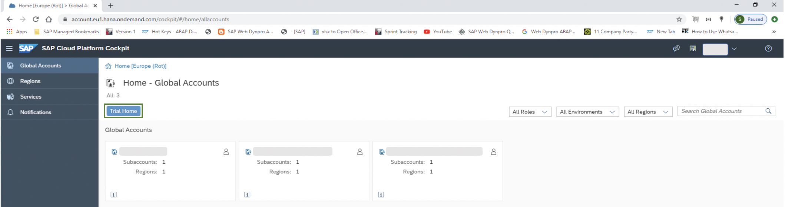

## Enablement of SAP IoT Service in Cloud Foundry environment on SAP Cloud Platform: -

Open [SAP Cloud Platform Cockpit](https://account.hana.ondemand.com/) and register yourself, if you have already registered then logon with your user credential. 

If you work in an enterprise account, add quotas to the services you purchased in your subaccount to make them visible on the Service Marketplace. If you don’t have any enterprise account, click on ‘Trial Home’. It will navigate you to default global account ‘I/S/C Number + trial’, add quotas to the services you purchased in your subaccount.
