## Enablement of SAP IoT Service in Cloud Foundry environment on SAP Cloud Platform: -

Open [SAP Cloud Platform Cockpit](https://account.hana.ondemand.com/) and register yourself, if you have already registered then logon with your user credential. 

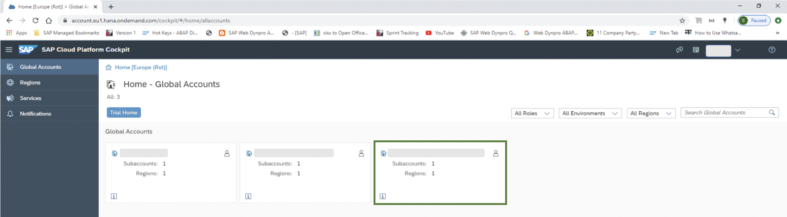

If you work in an enterprise account, add quotas to the services you purchased in your subaccount to make them visible on the Service Marketplace. If you don’t have any enterprise account, click on __‘Trial Home’__. It will navigate you to default global account __‘I/S/C Number + trial’__, add quotas to the services you purchased in your subaccount.

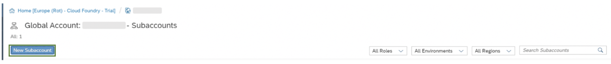

Click on button __‘New Subaccount’__. A popup will appear. Fill the details for new subaccount as shown in below screen shot and click button __‘Create’__.

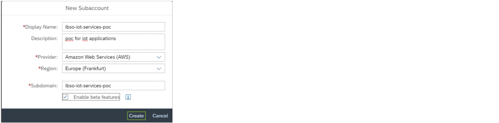

A New subaccount is created. Click on newly created subaccount. Click on button __‘Enable Cloud Foundry’__. 

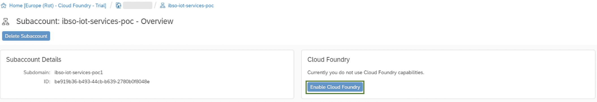

There would be a popup for __‘Organization Name’__ which will have default name  __‘<Global account name>_<Subaccount name>__.

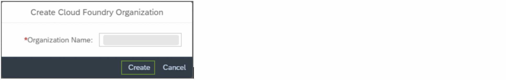  
  
On press button __‘Create’__, It will create a new Cloud Foundry Organization with filled name. Now click on button __‘Create Space’__.

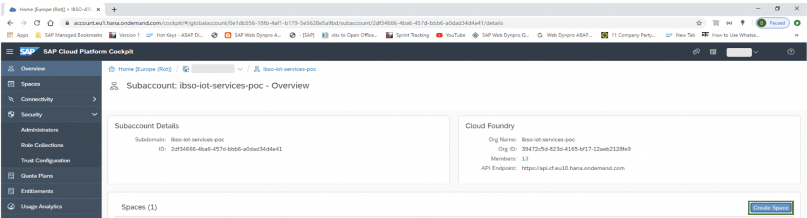

A dialog would be opened and enter details as per shown in below screenshot and press button __‘Create’__.

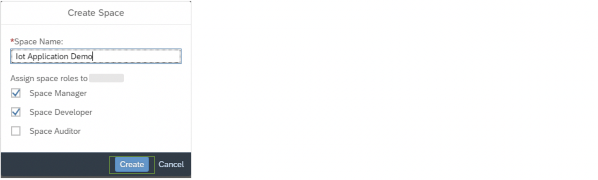

It will create a new Space with filled name and you can see newly added Space in __‘Space’__ section.

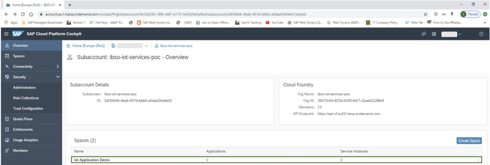

Click on newly created Space. It will navigate to that space. You can see section __‘Service’__ tab in left side of page. This tab is having 3 sections – __Service Marketplace__ (SAP provided services for which user has taken subscription), __Service Instances__ (Instances created by user), __User Provided Services__.

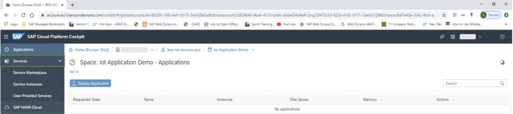

Click on first tab __Service Marketplace__. You can see tile for __‘Internet of Things’__ service, if you have subscription for this service. 

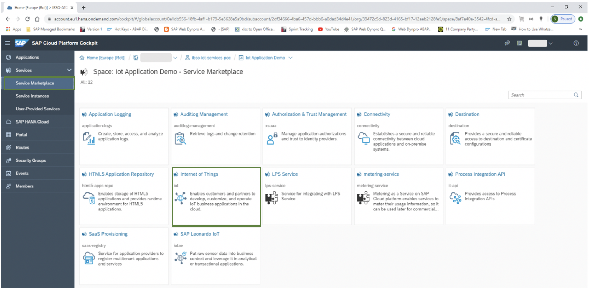

Click on this tile, user can see documentation and Standard plans for this service. 

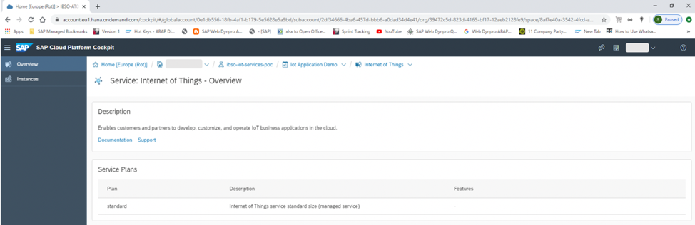

Click on __‘Instances’__ in left most section and press button __‘New Instance’__ to create a new instance of IoT Service. A popup will appear.

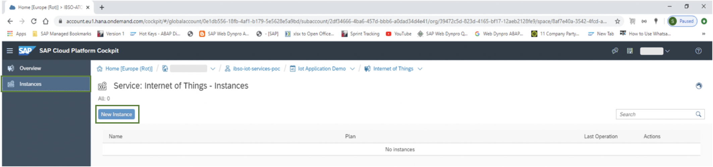

In first screen __(Choose Service Plan)__, select __‘standard’__ service plan and press button __‘Next’__. 

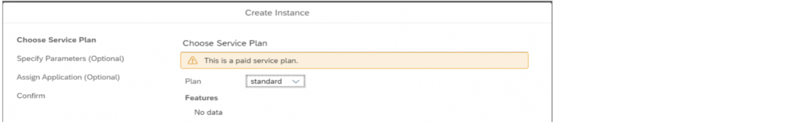

Next screen __(Specify Parameters)__ is optional, so just press button __‘Next’__. 

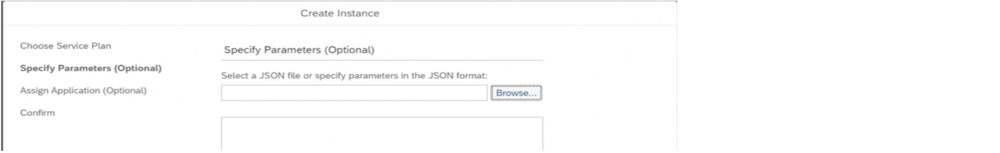

Next screen __Assign Application)__ is also optional, so just press button __‘Next’__. 

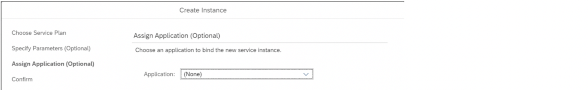

In last screen __(Confirm)__, Enter a suitable instance name and press button __‘Finish’__. 

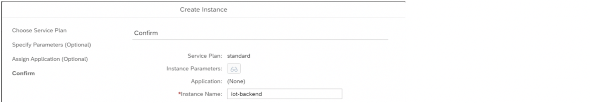

A popup will appear, press __‘OK’__. 

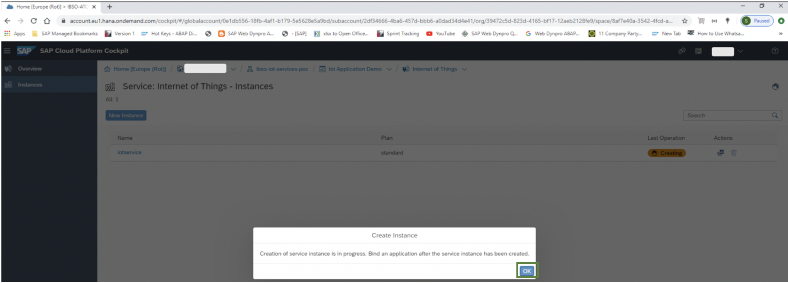

A new IoT instance will be created. Sometimes it may take significant amount of time.

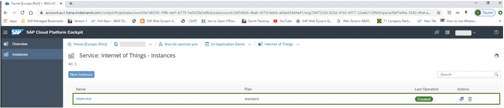

On click of newly created instance, user will be navigated to detailed page. 

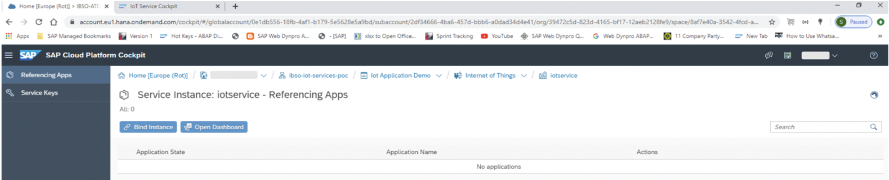

Now create a service key for instance, for that select __‘Service Keys’__ in left most section and click on button __‘Create Service Key’__.

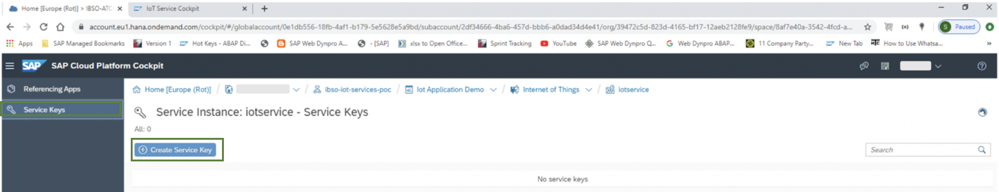

A popup will appear, enter an appropriate name for Service Key and press button __‘Save’__. 

It will create a service key, which contains __instanceId__ (IoT instance Id), __cockpitUrl__ (IoT Cockpit URL), __username__ (Cockpit Username), __password__ (Cockpit Password). __Copy username and password, which will be required for IoT Cockpit Login screen__.

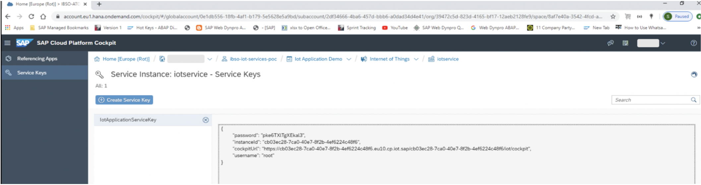

Go to space __‘IoT Application Demo’__ and select tab __‘Service Instances’__ under section __‘Services’__ in leftmost part of page. Click on icon __‘Open Dashboard’__ in __‘Action’__ column of rightmost part of page as shown in below screenshot.

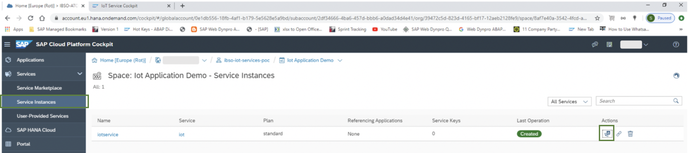

On click of icon __‘Open Dashboard’__, __Internet of Things Service Cockpit__ is opened in new tab. 

Enter username and password in login screen as mentioned in above step (you can find in below screenshot). 

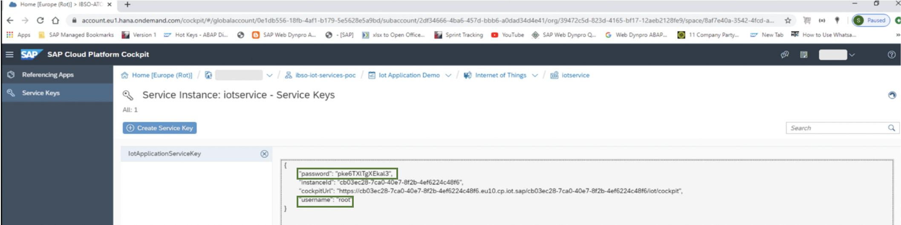

Press button __‘Log On’__.

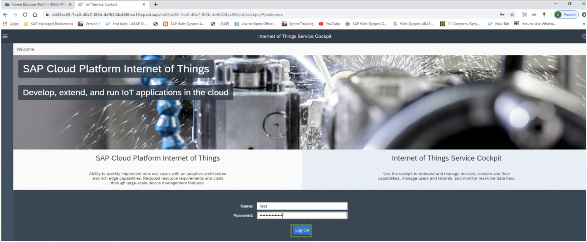

## Configuration of IoT things (Capability, Sensor Type, Sensor and Device) in IoT Service Cockpit: -

You can see Dashboard of __‘IoT Service Cockpit’__. 

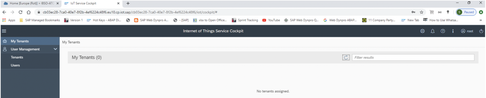

In left side toolbar, select __‘Tenants’__ tab and click on icon __‘+’__ in right side of page to add a new tenant.

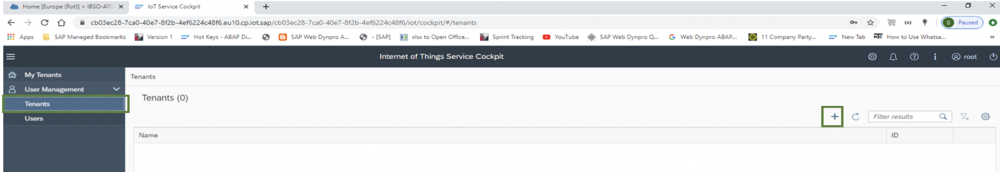

A new screen will be opened for tenant creation. 

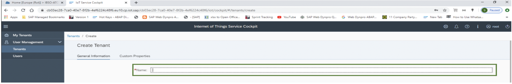

Enter a suitable tenant name and press footer bar button __‘Create’__. 

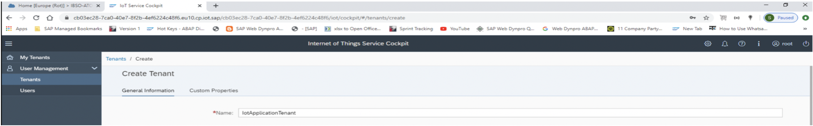

A new tenant is added with auto generated unique __‘ID’__. Click on icon __‘+’__ to assign user to tenant. 

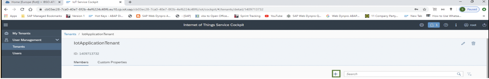

Popup will open to add member. 

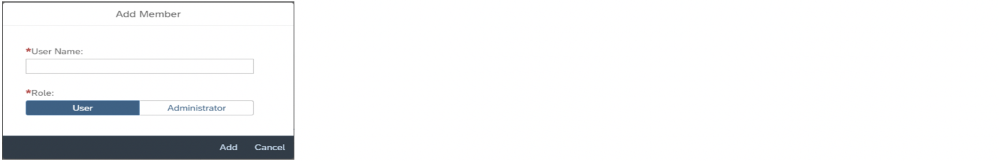

Enter user name as __‘root’__ and role as __‘User’__. Press button __‘Add’__. 

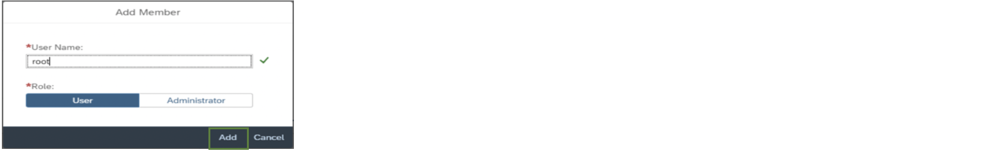

Click on tab __‘Tenants’__ under __‘User Management’__ Section. User can see newly added tenant and on click of tenant, user can see added users under __‘Members’__ section of tenant. 

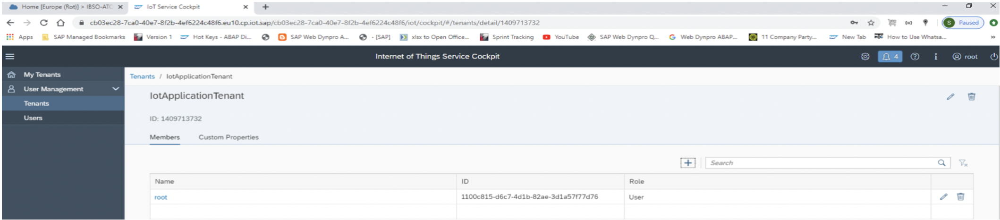

Select tab __‘My Tenants’__ under __‘User Management’__ Section, all the tenants would be listed here. 

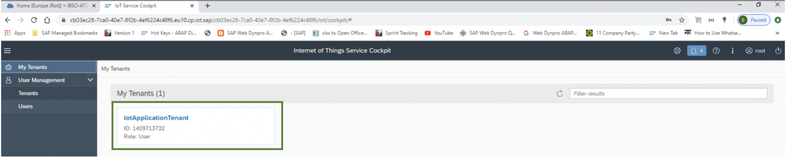

Click on tenant __‘IotApplicationTenant’__. It will navigate you to that tenant. Select __‘Device Management’__ tab from left side toolbar where you can see __Devices, Sensors, Sensor Types, Capabilities, Gateways__ etc. 

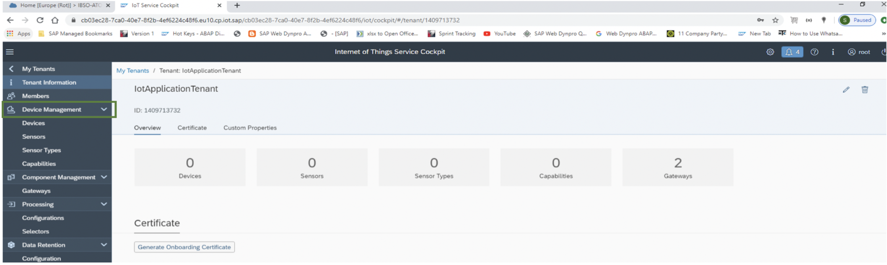

Select __‘Capabilities’__ under __‘Device Management’__, click on icon __‘+’__ to add a new capability. 

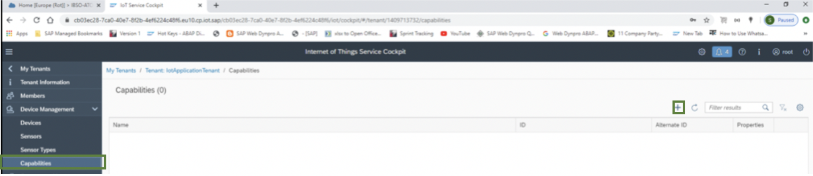

A new screen will be opened. Enter a suitable capability __Name, Alternate Id__ in __General Information section__ and click on icon __‘+’__ in __Properties section__ to add properties as per your requirement. Add property __Name and Data Type__ as shown in below screen. 

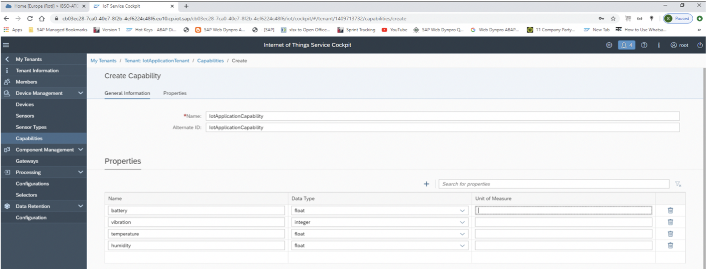

Press footer bar button __‘Create’__. A confirmation popup will appear, click on button __‘Confirm’__. 

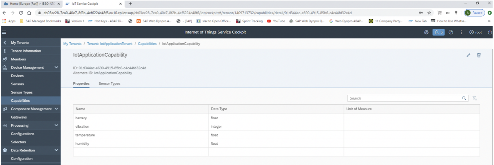

Select __‘Sensor Types’__ under __‘Device Management’__, click on icon __‘+’__ to add a new sensor type. 

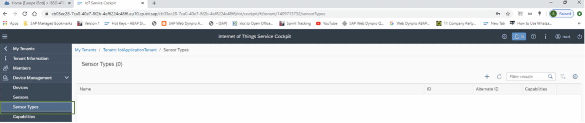

A new screen will be opened. 

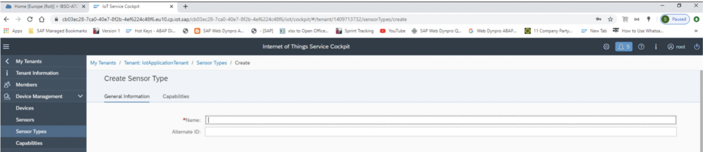

Enter a suitable sensor __Name, Alternate Id__ in __General Information section__ and click on icon __‘+’__ in __Capabilities section__. Add capability from drop down as shown in below screen. Press footer bar button __‘Create’__.

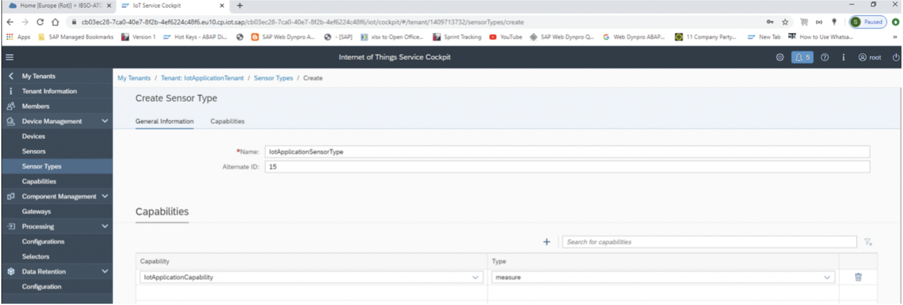

A new Sensor Type is added. 

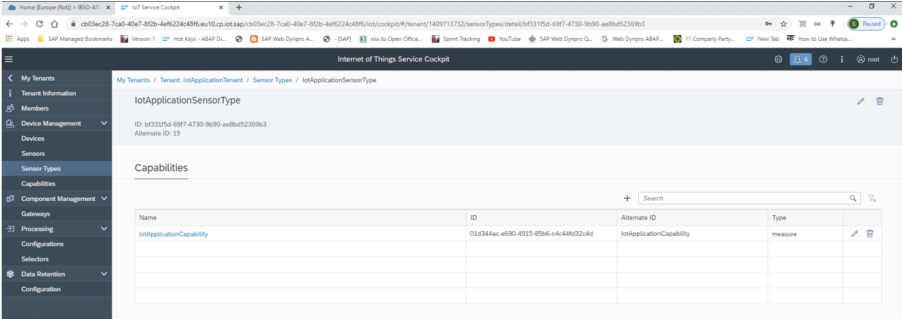

Select __‘Devices’__ under __‘Device Management’__, click on icon __‘+’__ to add a new device. 

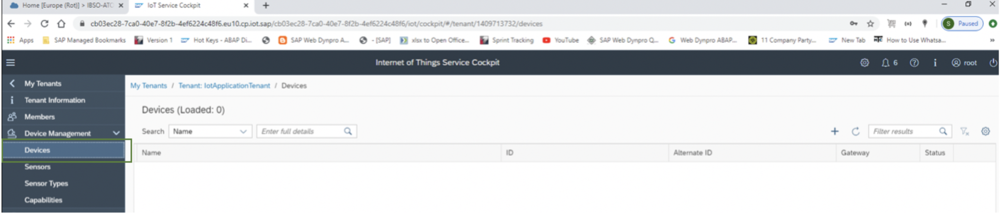

A new screen will be opened. Enter a suitable device __Name, Gateway (REST), Alternate Id__ in __General Information section__. Press footer bar button __‘Create’__. 

A confirmation popup will appear, click on button __‘Confirm’__. Select tab __‘Sensors’__ under __‘IotApplicationDevice’__, click on icon __‘+’__ to add a new device. 

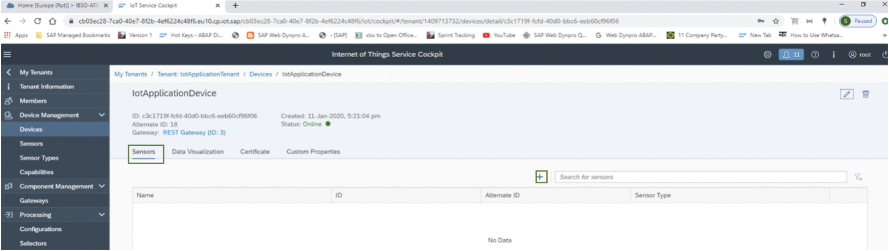

A new screen will be opened. Enter a valid sensor __Name, Sensor Type, Alternate ID__ in __General Information section__. Press button __‘Confirm’__ in confirmation popup. 

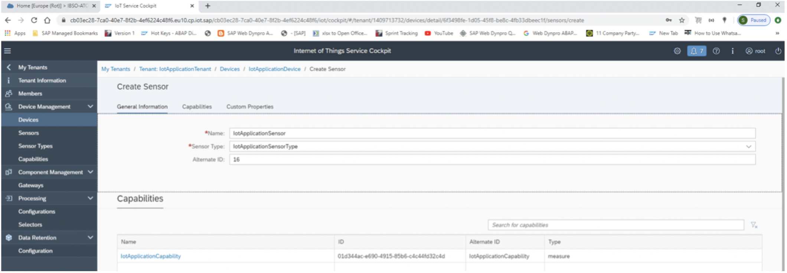

Select tab __‘Certificate’__ under __‘IotApplicationDevice’__, press button __‘Generate Certificate’__.

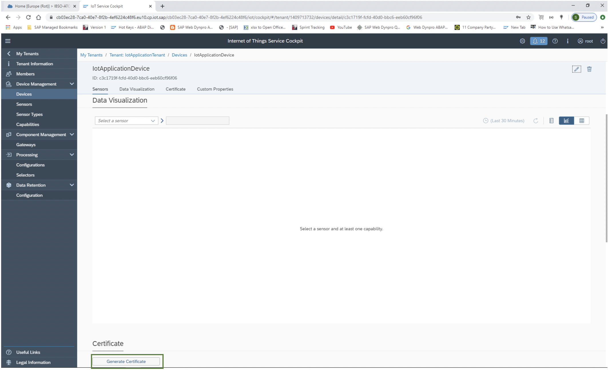

Select __‘pem’__ in __Certificate Type__. Press button __‘Generate’__. 

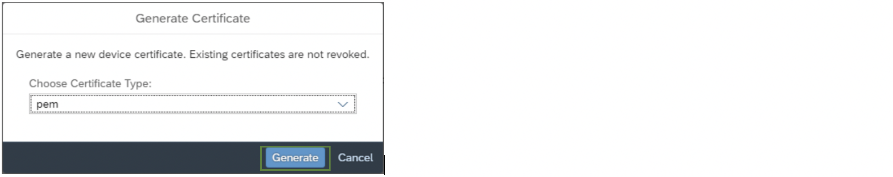

A file with name __‘<Device name>-device_certificate.pem’__ will be downloaded to browser default download location and a popup will appear with __Certificate Secret__. Copy secret key which will be required for data ingestion.

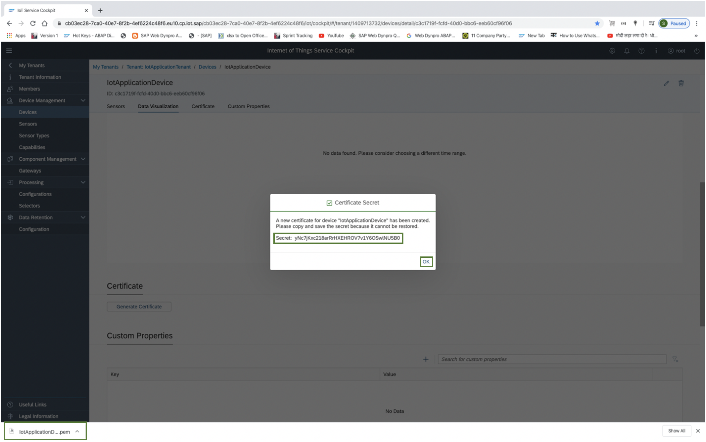
  
__Curl Command for data ingestion__: - In MacBook curl command is already available. For windows you need to install curl command using link.
https://stackoverflow.com/questions/9507353/how-do-i-install-and-use-curl-on-windows
Open command prompt and go to the folder where pem certificate is downloaded. 

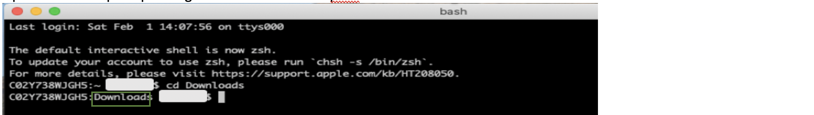

Write command as shown.

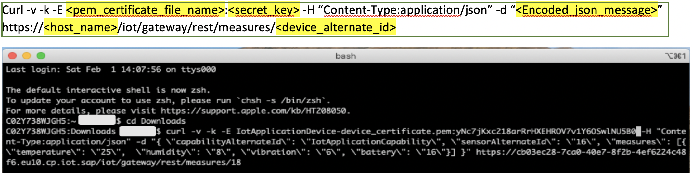

Press __'Enter'__. You can see __status 202__ which is an indicator that data has been successfully ingested in IoT Cockpit.

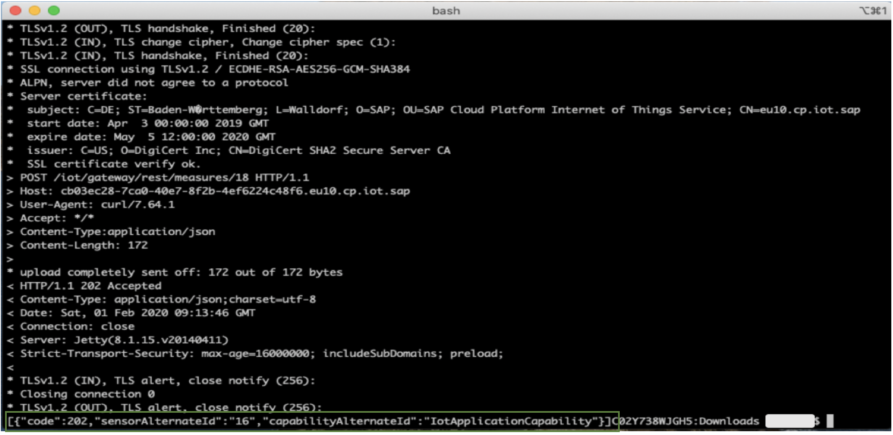

Select tab __‘Data Visualization’__ under __‘IotApplicationDevice’__, select sensor name which is assigned to device. Click on segmented icon __‘Tabular data or Graphicaldata’__ on right most side of table toolbar.


Similarly, using curl command, you can push more data records and see it in tabular/graphical form as mentioned above steps.


Now click on __‘Tenant Information’__ tab, user can see all the created Devices, Sensors, Sensor Types, Capabilities and Gateways.


## Setup connection between IoT Service and UI5 Application (Destination Creation): -

Now we will create a destination to consume IoT data in SAP UI5 application. Go to subaccount __‘ibso-iot-services-poc’__ and click on __‘Destination’__ under __‘Connectivity’__ section in leftmost toolbar of page. Click on __‘New Destination’__.


Create a new destination as shown in below screen shot.


Press button __‘Save’__.

Click on button __‘Check Connection’__. 


It will show message: __Connection to {device} established. Response returned: “302: Found”__
  


## SAP UI5 Application development consuming IoT data: -

Click on Services in leftmost menu of page as we did for service __‘Internet of Things’__. Select tile __‘SAP Web IDE Full-Stack’__ and enable service, if not already done and click on link __‘Go to Service’__. It will take you through SAP Web IDE portal, where we will develop SAP UI5 application. 


Now right click on __‘Workspace’__ to create new UI5 application using standard template. 


In tab __‘Template Selection’__, choose tile __‘SAPUI5 Application’__ and press button __‘Next’__. 


In tab __‘Basic Information’__, Give a suitable Project Name and Namespace and press button __‘Next’__. 


In tab __‘Template Customization’__, Enter view name and press button __‘Next’__. 


In tab __‘Confirmation’__, Press button __Finish’__.


User can see newly created UI5 application under __workspace__ folder.


Open __neo-app.json__ file.


Add highlighted code in neo-app.json so that UI5 application can connect to IoT data through created destination.


Open __Main.view.xml__ file.

Add code as shown in below screenshot to show table in UI5 application. 


Open __Main.controller.js__ file.


Add code as shown in below screenshot to get data IoT data. 

Right click on project and press __Run -> Run as Web Application__. 


A Popup will appear, select __‘index.html’__ and press __‘OK’__. 


A UI5 application will be loaded in new tab with IoT data as shown in below screen.

